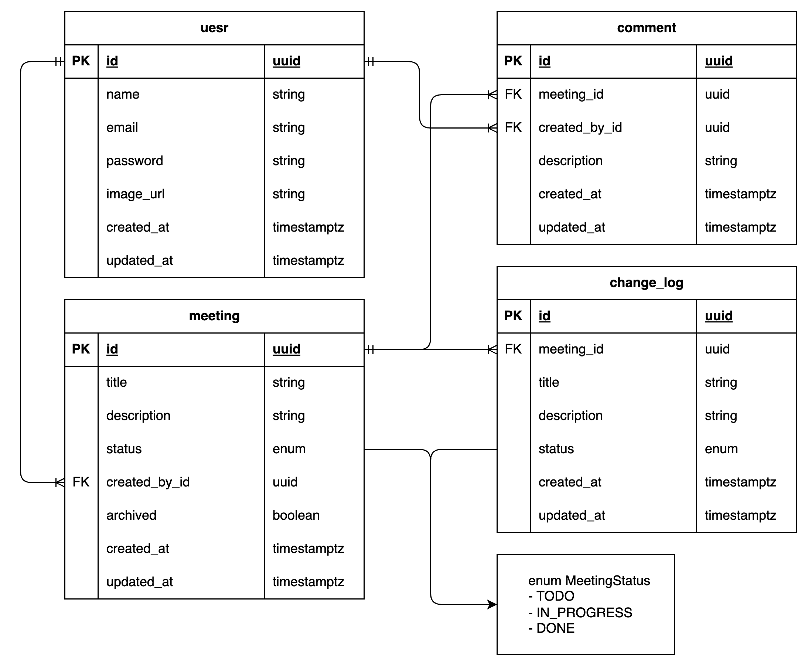

# 🛠️ Interview Meeting Management Service

A backend service built with **NestJS**, **TypeORM**, and **PostgreSQL** for managing meeting-related operations.

## 📦 Tech Stack

- [NestJS](https://nestjs.com/) – Progressive Node.js Framework
- [TypeORM](https://typeorm.io/) – ORM for TypeScript and JavaScript
- [PostgreSQL](https://www.postgresql.org/) – Open-source relational database
- [Docker Compose](https://docs.docker.com/compose/) – For container orchestration

---

## 🚀 Getting Started

### ✅ Requirements

- [Docker](https://www.docker.com/)
- [Docker Compose](https://docs.docker.com/compose/)
- (Optional) [Yarn](https://yarnpkg.com/) if running locally without Docker

---

### ⚙️ Environment Variables

Create a `.env` file in the root folder with the following content:

```env
# App
APP_PORT=3000

# Database
DATABASE_HOST=postgres
DATABASE_PORT=5432
DATABASE_USER=user
DATABASE_PASSWORD=api
DATABASE_NAME=interview-meeting-management

# Jwt config
JWT_SECRET_KEY=
JWT_ACCESS_TOKEN_TTL=3600
JWT_REFRESH_TOKEN_TTL=86400
```

---

### 🐳 Run with Docker

```bash
docker-compose up --build
```

> The service will be available at: [http://localhost:3000](http://localhost:3000)

---

### 🧪 Test Rate Limiting (10 requests/min)

We use `@nestjs/throttler` to limit API requests **per IP**.

#### 🔁 Auto-test with curl

```bash
for i in {1..15}; do
  curl -s -o /dev/null -w "%{http_code}\n" http://localhost:3000/
done
```

> After ~10 requests, you should see `429` (Too Many Requests)

#### Example output:
```
200
200
...
429
429
```

---

### 🧰 Useful Scripts (optional for local dev)

```bash
# Install dependencies
yarn

# Run dev mode (if not using docker)
yarn start:dev

# Format code
yarn format

# Run lint
yarn lint
```

---

## 🗂️ Entity Relationship Diagram



---

## 📂 Project Structure

```
src/
├── assets/                  # ER diagrams or other supporting visuals
├── config/                  # Global configuration (e.g. JWT)
├── entities/                # TypeORM entities
├── migrations               # Database seeding script
├── modules/                 # Feature modules
├── subscriber/              # Entity subscribers
├── utils/                   # Reusable helper functions
├── app.controller.ts        # Root-level controller
├── app.module.ts            # AppModule root definition
├── app.service.ts           # Root-level service
└── main.ts                  # Application bootstrap
```

---

### 🌱 Seeding the Database

Seeder script is located at `src/migrations/seeder.ts`. You can use it to populate your PostgreSQL database with initial data (e.g. users, meetings).

#### 📦 Install dependencies (if not yet)

```bash
yarn install
```

#### ▶️ Run the Seeder
```bash
yarn seed
```
> ℹ️ This assumes your `seeder.ts` bootstraps the NestJS `AppModule` and runs insert logic using a service or repository.

---

## 📮 API Documentation

Swagger is available at:

> [http://localhost:3000/api](http://localhost:3000/api)

---

## 📌 Notes

- Be sure to install `pg` package (`yarn add pg`) for PostgreSQL support.
- `docker-compose` handles database initialization.
- Uses `ThrottlerGuard` globally to rate-limit API calls.